Metabolomic first pass data analysis
================
The Cooperstone lab
Lots of times

- [Load libraries](#load-libraries)
- [Read in data](#read-in-data)
- [Wrangle sample names](#wrangle-sample-names)
- [Data summaries](#data-summaries)
- [Missing data](#missing-data)
  - [Surveying missingness](#surveying-missingness)
  - [Imputing missing values](#imputing-missing-values)
- [Feature clustering with `notame`](#feature-clustering-with-notame)
  - [Wrangling data](#wrangling-data)
  - [Find connections](#find-connections)
  - [Clustering](#clustering)
- [Assessing data quality](#assessing-data-quality)
  - [Untransformed data](#untransformed-data)
  - [Transformed data](#transformed-data)
    - [Log2 transformed](#log2-transformed)
    - [Log10 transformed](#log10-transformed)
    - [Autoscaled](#autoscaled)
    - [Pareto scaled](#pareto-scaled)
- [PCAs](#pcas)
  - [With QCs](#with-qcs)
  - [Without QCs](#without-qcs)
- [Univariate Testing](#univariate-testing)

The code below has been written by Emma Bilbrey, JL Hartman, Jenna
Miller, Daniel Quiroz Moreno, Maria Sholola, and Jessica Cooperstone,
and its purpose is to take deconvoluted and filtered (i.e., for CV in
QCs, and removing features present in the blanks), and conduct a first
pass metabolomics analysis.

### Load libraries

``` r
library(factoextra) # visualizing PCA results
library(glue) # for easy pasting
library(plotly) # quick interactive plots
library(proxyC) # more efficient large matrices
library(data.table) # easy transposing
library(janitor) # for cleaning names and checking duplicates
library(notame) # for collapsing ions coming from the same metabolite
library(doParallel) # for parallelizing notame specifically
library(patchwork) # for making multi-panel plots
library(rstatix) # for additional univariate functionality

# this is at the end hoping that the default select will be that from dplyr
library(tidyverse) # for everything
```

## Read in data

We are reading data collected by JL Hartman of full scan high resolution
MS based metabolomics data in ESI negative mode, with reversed phase/C18
chromatography. This input file is the output of the previous filtering
step. We are also reading in some meta-data.

``` r
# read in metabolomics data
metab <- read_csv("data/BNB_neg_filtered_template.csv",
                  trim_ws = TRUE)
```

    ## Rows: 3945 Columns: 117
    ## ── Column specification ────────────────────────────────────────────────────────
    ## Delimiter: ","
    ## chr   (1): mz_rt
    ## dbl (116): 1002_1_013, 1005_1_016, 1028_7_042, 1006_1_017, 1011_3_023, 1012_...
    ## 
    ## ℹ Use `spec()` to retrieve the full column specification for this data.
    ## ℹ Specify the column types or set `show_col_types = FALSE` to quiet this message.

``` r
# read in meta data
metadata <- read_csv("data/BNBpilot_metadata.csv",
                     trim_ws = TRUE)
```

    ## Rows: 111 Columns: 8
    ## ── Column specification ────────────────────────────────────────────────────────
    ## Delimiter: ","
    ## chr (7): plot, accession, species, tarapoto, color, bitter, selected
    ## dbl (1): rep
    ## 
    ## ℹ Use `spec()` to retrieve the full column specification for this data.
    ## ℹ Specify the column types or set `show_col_types = FALSE` to quiet this message.

Take a quick look at our data.

``` r
# look at first 5 rows, first 5 columns 
metab[1:5,1:5]
```

    ## # A tibble: 5 × 5
    ##   mz_rt           `1002_1_013` `1005_1_016` `1028_7_042` `1006_1_017`
    ##   <chr>                  <dbl>        <dbl>        <dbl>        <dbl>
    ## 1 215.035_0.6816      7679077      7447086.     8276088      8841574 
    ## 2 132.0314_0.6257     6205564.     4927318.     4093699.     4349956 
    ## 3 146.0471_0.638      4960052.     2120450.     1493171      4152962.
    ## 4 223.047_0.6813      4479680      2886648.     3665020.     4198727 
    ## 5 277.0354_0.6491     4078063      4136307      6126944.     5292943

``` r
# look at first 5 rows, all columns 
metadata[1:5,]
```

    ## # A tibble: 5 × 8
    ##   plot  accession   rep species tarapoto color bitter selected
    ##   <chr> <chr>     <dbl> <chr>   <chr>    <chr> <chr>  <chr>   
    ## 1 1009  LA0462        1 SPE     N        G     NO     Y       
    ## 2 1067  LA0462        2 SPE     N        G     NO     Y       
    ## 3 1093  LA0462        3 SPE     N        G     NO     Y       
    ## 4 1015  LA0722        1 SPI     N        R     UNK    Y       
    ## 5 1058  LA0722        2 SPI     N        R     UNK    Y

``` r
# check dimensions
dim(metab)
```

    ## [1] 3945  117

``` r
dim(metadata)
```

    ## [1] 111   8

## Wrangle sample names

Here, the samples are in columns and the features are in rows. Samples
are coded so that the first number is the plot code, the second number
is what QC batch is that a sample a part of, and the third number is the
overall run over. We want to separate this information.

``` r
samples <- as.data.frame(colnames(metab)) %>%
  filter(!`colnames(metab)` == "mz_rt") %>%
  separate_wider_delim(cols = `colnames(metab)`,
                       delim = "_",
                       names = c("plot", "qc_batch", "run_order"),
                       cols_remove = FALSE) %>%
  rename(sample = `colnames(metab)`)

head(samples)
```

    ## # A tibble: 6 × 4
    ##   plot  qc_batch run_order sample    
    ##   <chr> <chr>    <chr>     <chr>     
    ## 1 1002  1        013       1002_1_013
    ## 2 1005  1        016       1005_1_016
    ## 3 1028  7        042       1028_7_042
    ## 4 1006  1        017       1006_1_017
    ## 5 1011  3        023       1011_3_023
    ## 6 1012  3        024       1012_3_024

Combining data about QC batch and run order into meta-data file.

``` r
metadata_plus <- left_join(samples, metadata, by = "plot")
```

Making a new column that will indicate whether a sample is a “sample” or
a “QC”

``` r
metadata_plus <- metadata_plus %>%
  mutate(sample_or_qc = if_else(str_detect(plot, "QC"), true = "QC", false = "Sample")) %>%
  dplyr::select(plot, sample, everything()) # and move Sample to the front
```

Change sample names to just be plot.

``` r
# save as a new df called metab_renamed
metab_renamed <- metab 

# add mz_rt to be the first item in samples$plot
to_rename <- c("mz_rt", samples$plot)

# rename all columns
colnames(metab_renamed) <- to_rename
```

Go from wide to long data.

``` r
metab_long <- metab %>%
  mutate(across(.cols = 2:ncol(.), .fns = as.numeric)) %>% # convert intensity to numeric
  pivot_longer(cols = -mz_rt, # all but mz_rt
               names_to = "sample",
               values_to = "rel_abund")

glimpse(metab_long)
```

    ## Rows: 457,620
    ## Columns: 3
    ## $ mz_rt     <chr> "215.035_0.6816", "215.035_0.6816", "215.035_0.6816", "215.0…
    ## $ sample    <chr> "1002_1_013", "1005_1_016", "1028_7_042", "1006_1_017", "101…
    ## $ rel_abund <dbl> 7679077, 7447086, 8276088, 8841574, 8093700, 7780702, 755259…

Add meta-data.

``` r
metab_long_meta <- left_join(metab_long, metadata_plus, by = "sample")
```

Also add separate columns for mz and rt, and making both numeric.

``` r
metab_long_meta <- metab_long_meta %>%
  separate_wider_delim(cols = mz_rt,
                       delim = "_",
                       names = c("mz", "rt"),
                       cols_remove = FALSE) %>%
  mutate(across(.cols = 1:2, .fns = as.numeric))  %>% # convert mz and rt to numeric
  drop_na(mz, rt) # maybe not actually necessary

# how did that go?
head(metab_long_meta)
```

    ## # A tibble: 6 × 16
    ##      mz    rt mz_rt    sample rel_abund plot  qc_batch run_order accession   rep
    ##   <dbl> <dbl> <chr>    <chr>      <dbl> <chr> <chr>    <chr>     <chr>     <dbl>
    ## 1  215. 0.682 215.035… 1002_…  7679077  1002  1        013       LA2303        1
    ## 2  215. 0.682 215.035… 1005_…  7447086. 1005  1        016       LA2262        1
    ## 3  215. 0.682 215.035… 1028_…  8276088  1028  7        042       LA2293        1
    ## 4  215. 0.682 215.035… 1006_…  8841574  1006  1        017       LA2307        1
    ## 5  215. 0.682 215.035… 1011_…  8093700. 1011  3        023       LA2288        1
    ## 6  215. 0.682 215.035… 1012_…  7780702. 1012  3        024       LA2290        1
    ## # ℹ 6 more variables: species <chr>, tarapoto <chr>, color <chr>, bitter <chr>,
    ## #   selected <chr>, sample_or_qc <chr>

## Data summaries

What mass range do I have?

``` r
range(metab_long_meta$mz)
```

    ## [1]  100.0405 1687.8049

What retention time range do I have?

``` r
range(metab_long_meta$rt)
```

    ## [1] 0.5245 7.4644

How many samples are in each of my meta-data groups?

``` r
# make wide data to make some calculations easier
metab_wide_meta <- metab_long_meta %>%
  dplyr::select(-mz, -rt) %>%
  pivot_wider(names_from = mz_rt,
              values_from = rel_abund)

# by sample vs QC
metab_wide_meta %>%
  count(sample)
```

    ## # A tibble: 116 × 2
    ##    sample         n
    ##    <chr>      <int>
    ##  1 1002_1_013     1
    ##  2 1003_1_014     1
    ##  3 1004_1_015     1
    ##  4 1005_1_016     1
    ##  5 1006_1_017     1
    ##  6 1007_1_018     1
    ##  7 1008_3_020     1
    ##  8 1009_3_021     1
    ##  9 1010_3_022     1
    ## 10 1011_3_023     1
    ## # ℹ 106 more rows

``` r
# by species
# NAs are the QCs
metab_wide_meta %>%
  count(species)
```

    ## # A tibble: 5 × 2
    ##   species     n
    ##   <chr>   <int>
    ## 1 SL         65
    ## 2 SLC        21
    ## 3 SPE         3
    ## 4 SPI        10
    ## 5 <NA>       17

What does my data coverage across mz and rt look like?

``` r
metab_long_meta %>%
  group_by(mz_rt) %>% # so we only have one point per feature
  ggplot(aes(x = rt, y = mz)) +
  geom_point() +
  theme_minimal() +
  labs(x = "Retention time (min)",
       y = "Mass to charge ratio (m/z)",
       title = "m/z by retention time plot (all features)",
       subtitle = "C18 reversed phase, negative ionization mode")
```

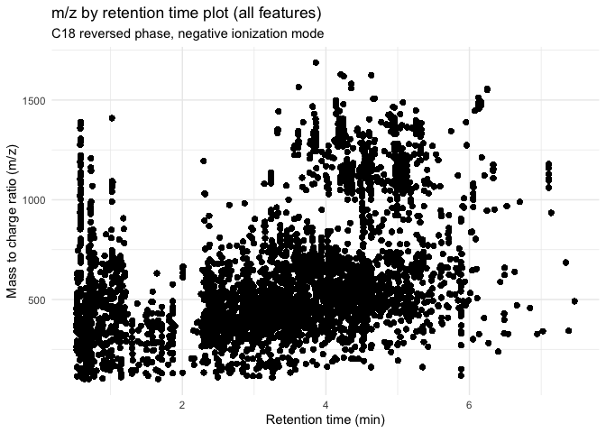<!-- -->

Distribution of masses

``` r
metab_long_meta %>%
  group_by(mz_rt) %>%
  ggplot(aes(x = mz)) +
  geom_histogram(bins = 100) +
  theme_minimal() +
  labs(x = "m/z",
       y = "Number of features",
       title = "Distribution of features by mass")
```

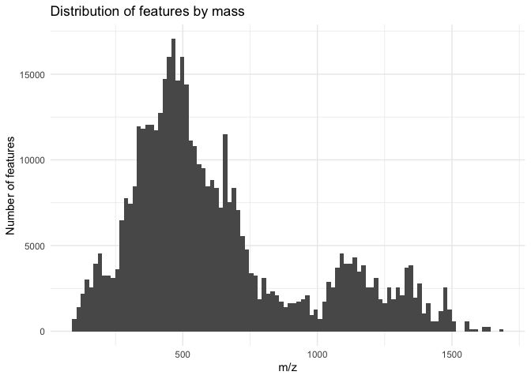<!-- -->

Distribution of retention times

``` r
metab_long_meta %>%
  group_by(mz_rt) %>%
  ggplot(aes(x = rt)) +
  geom_density() +
  theme_minimal() +
  labs(x = "Retention time",
       y = "Number of features",
       title = "Distribution of features by retention time")
```

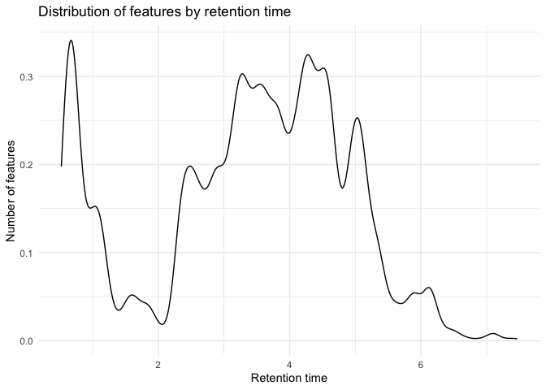<!-- -->

## Missing data

### Surveying missingness

How many missing values are there for each feature?

``` r
# all data including QCs
# how many missing values are there for each feature (row)
na_by_feature <- rowSums(is.na(metab)) %>%
  as.data.frame() %>%
  rename(missing_values = 1)

na_by_feature %>%
  ggplot(aes(x = missing_values)) +
  geom_histogram(bins = 116) + # since 116 samples
  theme_minimal() + 
  labs(title = "Number of missing values for each feature",
       x = "Number of missing values",
       y = "How many features have that \nmany missing values")
```

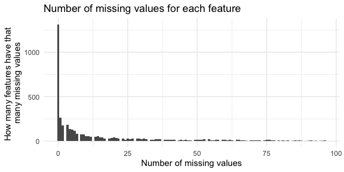<!-- -->

How many features have no missing values?

``` r
na_by_feature %>%
  count(missing_values == 0)
```

    ##   missing_values == 0    n
    ## 1               FALSE 2631
    ## 2                TRUE 1314

How many missing values are there for each sample?

``` r
# all data including QCs
# how many missing values are there for each feature (row)
na_by_sample <- colSums(is.na(metab)) %>%
  as.data.frame() %>%
  rename(missing_values = 1) %>%
  rownames_to_column(var = "feature") %>%
  filter(!feature == "mz_rt")

na_by_sample %>%
  ggplot(aes(x = missing_values)) +
  geom_histogram(bins = 100) + # there are 3948 features
  theme_minimal() + 
  labs(title = "Number of missing values for each sample",
       x = "Number of missing values",
       y = "How many samples have that \nmany missing values")
```

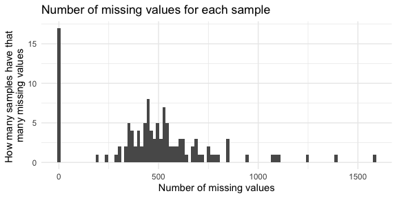<!-- -->

Which features have a lot of missing values?

``` r
contains_NAs_feature <- metab_long_meta %>%
  group_by(mz_rt) %>%
  count(is.na(rel_abund)) %>%
  filter(`is.na(rel_abund)` == TRUE) %>%
  arrange(desc(n))

head(contains_NAs_feature)
```

    ## # A tibble: 6 × 3
    ## # Groups:   mz_rt [6]
    ##   mz_rt            `is.na(rel_abund)`     n
    ##   <chr>            <lgl>              <int>
    ## 1 1428.6063_4.8916 TRUE                  96
    ## 2 595.9954_4.7885  TRUE                  96
    ## 3 597.9932_4.7868  TRUE                  96
    ## 4 795.2148_4.7744  TRUE                  96
    ## 5 811.2099_4.5058  TRUE                  96
    ## 6 1114.0322_4.5385 TRUE                  95

Which samples have a lot of missing values?

``` r
contains_NAs_sample <- metab_long_meta %>%
  group_by(plot) %>%
  count(is.na(rel_abund)) %>%
  filter(`is.na(rel_abund)` == TRUE) %>%
  arrange(desc(n))

head(contains_NAs_sample)
```

    ## # A tibble: 6 × 3
    ## # Groups:   plot [6]
    ##   plot    `is.na(rel_abund)`     n
    ##   <chr>   <lgl>              <int>
    ## 1 NC28173 TRUE                1583
    ## 2 OH8243  TRUE                1393
    ## 3 1002    TRUE                1251
    ## 4 1029    TRUE                1106
    ## 5 1074    TRUE                1084
    ## 6 1102    TRUE                1065

Are there any missing values in the QCs? (There shouldn’t be.)

``` r
metab_QC <- metab %>%
  dplyr::select(contains("QC"))

na_by_sample <- colSums(is.na(metab_QC)) %>%
  as.data.frame() %>%
  rename(missing_values = 1) %>%
  rownames_to_column(var = "feature") %>%
  filter(!feature == "mz_rt")

sum(na_by_sample$missing_values) # nope
```

    ## [1] 0

### Imputing missing values

This is an optional step but some downstream analyses don’t handle
missingness well. Here we are imputing missing data with half the lowest
value observed for that feature.

``` r
# grab only the feature data and leave metadata
metab_wide_meta_imputed <- metab_wide_meta %>%
  dplyr::select(-c(1:12)) 

metab_wide_meta_imputed[] <- lapply(metab_wide_meta_imputed,
                                 function(x) ifelse(is.na(x), min(x, na.rm = TRUE)/2, x))

# bind back the metadata
metab_wide_meta_imputed <- bind_cols(metab_wide_meta[,1:12], metab_wide_meta_imputed)

# try working from original metab input file
metab_imputed <- metab %>%
  dplyr::select(-mz_rt)

metab_imputed[] <- lapply(metab_imputed,
                          function(x) ifelse(is.na(x), min(x, na.rm = TRUE)/2, x))

# bind back metadata
metab_imputed <- bind_cols (metab[,1], metab_imputed)
```

Did imputing work?

``` r
metab_wide_meta_imputed %>%
  dplyr::select(-c(1:11)) %>%
  is.na() %>%
  sum()
```

    ## [1] 0

Create long imputed dataset.

``` r
metab_long_meta_imputed <- metab_wide_meta_imputed %>%
  pivot_longer(cols = 13:ncol(.),
               names_to = "mz_rt",
               values_to = "rel_abund")

head(metab_long_meta_imputed)
```

    ## # A tibble: 6 × 14
    ##   sample  plot  qc_batch run_order accession   rep species tarapoto color bitter
    ##   <chr>   <chr> <chr>    <chr>     <chr>     <dbl> <chr>   <chr>    <chr> <chr> 
    ## 1 1002_1… 1002  1        013       LA2303        1 SL      Y        R     UNK   
    ## 2 1002_1… 1002  1        013       LA2303        1 SL      Y        R     UNK   
    ## 3 1002_1… 1002  1        013       LA2303        1 SL      Y        R     UNK   
    ## 4 1002_1… 1002  1        013       LA2303        1 SL      Y        R     UNK   
    ## 5 1002_1… 1002  1        013       LA2303        1 SL      Y        R     UNK   
    ## 6 1002_1… 1002  1        013       LA2303        1 SL      Y        R     UNK   
    ## # ℹ 4 more variables: selected <chr>, sample_or_qc <chr>, mz_rt <chr>,
    ## #   rel_abund <dbl>

Let’s also make separate mz and rt columns.

``` r
metab_long_meta_imputed <- metab_long_meta_imputed %>%
  separate_wider_delim(cols = mz_rt,
                       delim = "_",
                       names = c("mz", "rt"),
                       cols_remove = FALSE)

metab_long_meta_imputed$mz <- as.numeric(metab_long_meta_imputed$mz)
metab_long_meta_imputed$rt <- as.numeric(metab_long_meta_imputed$rt)
```

## Feature clustering with `notame`

We want to cluster features that likely come from the same metabolite
together, and we can do this using the package `notame`. You can learn
more
[here](http://127.0.0.1:24885/library/notame/doc/feature_clustering.html).

``` r
browseVignettes("notame")
```

Let’s make a m/z by retention time plot again before we start.

``` r
(before_notame <- metab_long_meta_imputed %>%
  group_by(mz_rt) %>% # so we only have one point per feature
  ggplot(aes(x = rt, y = mz)) +
  geom_point() +
  theme_minimal() +
  labs(x = "Retention time (min)",
       y = "Mass to charge ratio (m/z)",
       title = "m/z by retention time plot before notame",
       subtitle = "C18 reverse phase, negative ionization mode"))
```

<!-- -->

### Wrangling data

Transpose the wide data for notame and wrangle to the right format.
Below is info from the documentation:

- Data should be a data frame containing the abundances of features in
  each sample, one row per sample, each feature in a separate column
- Features should be a data frame containing information about the
  features, namely feature name (should be the same as the column name
  in data), mass and retention time

Going back to the original imported data and imputing from there seems
kind of silly, but I had a lot of problems structuring this data to get
find_connections() to run and not throw any errors because of names that
weren’t the same between the features and the data inputs.

It is important that for the Data, your first sample is in row 2. The
code below will get you there. If you’re wondering why the code is
written this way instead of just using metab_wide_meta_imputed, this is
why.

``` r
# # create a data frame which is just the original metab data
# transposed so samples are rows and features are columns
data_notame <- data.frame(metab_imputed %>%
                          t())

data_notame <- data_notame %>%
  tibble::rownames_to_column() %>% # change samples from rownames to its own column
  row_to_names(row_number = 1) # change the feature IDs (mz_rt) from first row obs into column names

# change to results to numeric
# it is important that the first row of data has the row number 2
# i don't know why this is but save yourself all the time maria/jess spent figuring out
# why this wasn't working
data_notame <- data_notame %>%
  mutate(across(-mz_rt, as.numeric))

tibble(data_notame)
```

    ## # A tibble: 116 × 3,946
    ##    mz_rt    `215.035_0.6816` `132.0314_0.6257` `146.0471_0.638` `223.047_0.6813`
    ##    <chr>               <dbl>             <dbl>            <dbl>            <dbl>
    ##  1 1002_1_…         7679077           6205564.         4960052.         4479680 
    ##  2 1005_1_…         7447086.          4927318.         2120450.         2886648.
    ##  3 1028_7_…         8276088           4093699.         1493171          3665020.
    ##  4 1006_1_…         8841574           4349956          4152962.         4198727 
    ##  5 1011_3_…         8093700.          1283594.          717827.         3046448.
    ##  6 1012_3_…         7780702.          3619702.          984710.         3364317.
    ##  7 1008_3_…         7552598.          4306122.         1110955.         3288646.
    ##  8 1003_1_…         7853164.          4434656          2269148.         3361332.
    ##  9 1004_1_…         8318853           4822632.         4202096.         4205750.
    ## 10 1010_3_…         8125583           2050616.         2020157.         3582409.
    ## # ℹ 106 more rows
    ## # ℹ 3,941 more variables: `277.0354_0.6491` <dbl>, `191.0559_0.7112` <dbl>,
    ## #   `217.0319_0.6659` <dbl>, `164.0727_2.5485` <dbl>, `317.0565_0.6744` <dbl>,
    ## #   `195.0524_0.6466` <dbl>, `111.0091_1.1441` <dbl>, `193.0369_0.6513` <dbl>,
    ## #   `205.0354_0.7258` <dbl>, `128.0358_1.2989` <dbl>, `175.0251_0.8885` <dbl>,
    ## #   `346.0577_1.0184` <dbl>, `253.0585_0.634` <dbl>, `209.0316_0.6497` <dbl>,
    ## #   `435.9603_1.1314` <dbl>, `128.9599_0.5843` <dbl>, …

Create df with features.

``` r
features <- metab_long_meta_imputed %>%
  dplyr::select(mz_rt, mz, rt) %>%
  mutate(across(c(mz, rt), as.numeric)) %>%
  as.data.frame() %>%
  distinct()

glimpse(features)
```

    ## Rows: 3,945
    ## Columns: 3
    ## $ mz_rt <chr> "215.035_0.6816", "132.0314_0.6257", "146.0471_0.638", "223.047_…
    ## $ mz    <dbl> 215.0350, 132.0314, 146.0471, 223.0470, 277.0354, 191.0559, 217.…
    ## $ rt    <dbl> 0.6816, 0.6257, 0.6380, 0.6813, 0.6491, 0.7112, 0.6659, 2.5485, …

``` r
class(features)
```

    ## [1] "data.frame"

### Find connections

Set `cache = TRUE` for this chunk since its a bit slow especially if you
have a lot of features. For ~4000 features takes ~12 min.

``` r
connection <- find_connections(data = data_notame,
                               features = features,
                               corr_thresh = 0.9,
                               rt_window = 1/60,
                               name_col = "mz_rt",
                               mz_col = "mz",
                               rt_col = "rt")
```

    ## Warning: executing %dopar% sequentially: no parallel backend registered

    ## [1] 100
    ## [1] 200
    ## [1] 300
    ## [1] 400
    ## [1] 500
    ## [1] 600
    ## [1] 700
    ## [1] 800
    ## [1] 900
    ## [1] 1000
    ## [1] 1100
    ## [1] 1200
    ## [1] 1300
    ## [1] 1400
    ## [1] 1500
    ## [1] 1600
    ## [1] 1700
    ## [1] 1800
    ## [1] 1900
    ## [1] 2000
    ## [1] 2100
    ## [1] 2200
    ## [1] 2300
    ## [1] 2400
    ## [1] 2500
    ## [1] 2600
    ## [1] 2700
    ## [1] 2800
    ## [1] 2900
    ## [1] 3000
    ## [1] 3100
    ## [1] 3200
    ## [1] 3300
    ## [1] 3400
    ## [1] 3500
    ## [1] 3600
    ## [1] 3700
    ## [1] 3800
    ## [1] 3900

``` r
head(connection)
```

    ##                 x               y       cor rt_diff  mz_diff
    ## 1  215.035_0.6816 217.0319_0.6659 0.9941479 -0.0157   1.9969
    ## 2  146.0471_0.638 244.0254_0.6419 0.9226148  0.0039  97.9783
    ## 3  146.0471_0.638 102.0564_0.6373 0.9760819 -0.0007 -43.9907
    ## 4 164.0727_2.5485 712.2216_2.5484 0.9170224 -0.0001 548.1489
    ## 5 164.0727_2.5485  683.268_2.5484 0.9122238 -0.0001 519.1953
    ## 6 164.0727_2.5485 547.1423_2.5477 0.9323268 -0.0008 383.0696

### Clustering

Now that we have found all of the features that are connected based on
the parameterers we have set, we now need to find clusters.

``` r
clusters <- find_clusters(connections = connection, 
                          d_thresh = 0.8)
```

    ## 493 components found

    ## Warning: executing %dopar% sequentially: no parallel backend registered

    ## Component 100 / 493 
    ## Component 200 / 493 
    ## Component 300 / 493 
    ## Component 400 / 493 
    ## 181 components found
    ## 
    ## Component 100 / 181 
    ## 52 components found
    ## 
    ## 13 components found
    ## 
    ## 3 components found

Assign a cluster ID to each feature to keep, and the feature that is
picked is the one with the highest median peak intensity across the
samples.

``` r
# assign a cluster ID to all features
# clusters are named after feature with highest median peak height
features_clustered <- assign_cluster_id(data_notame, 
                                        clusters, 
                                        features, 
                                        name_col = "mz_rt")
```

Export out a list of your clusters this way you can use this later
during metabolite ID.

``` r
# export clustered feature list this way you have it
write_csv(features_clustered,
          "data/features_notame-clusters-neg.csv")
```

Pull data out from the clusters and see how many features we
removed/have now.

``` r
# lets see how many features are removed when we only keep one feature per cluster
pulled <- pull_clusters(data_notame, features_clustered, name_col = "mz_rt")

cluster_data <- pulled$cdata
cluster_features <- pulled$cfeatures

# how many features did we originally have after filtering?
nrow(metab_imputed)
```

    ## [1] 3945

``` r
# how many features got removed during clustering?
nrow(metab_imputed) - nrow(cluster_features)
```

    ## [1] 1714

``` r
# what percentage of the original features were removed?
((nrow(metab_imputed) - nrow(cluster_features))/nrow(metab_imputed)) * 100
```

    ## [1] 43.4474

Reduce our dataset to include only our new clusters. `cluster_data`
contains only the retained clusters, while `cluster_features` tells you
also which features are a part of each cluster.

``` r
# combined metadata_plus with cluster_features
cluster_data <- cluster_data %>%
  rename(sample = mz_rt) # since this column is actually sample name

# make a wide df
metab_imputed_clustered_wide <- left_join(metadata_plus, cluster_data,
                                          by = "sample") %>%
  mutate(species = if_else(is.na(species), "QC", species))

# make a long/tidy df
metab_imputed_clustered_long <- metab_imputed_clustered_wide %>%
  pivot_longer(cols = 13:ncol(.),
               names_to = "mz_rt",
               values_to = "rel_abund") %>%
  separate_wider_delim(cols = mz_rt, # make separate columns for mz and rt too
                       delim = "_",
                       names = c("mz", "rt"),
                       cols_remove = FALSE) %>%
  mutate(across(.cols = c("mz", "rt"), .fns = as.numeric)) # make mz and rt numeric
```

Let’s look at a m/z by retention time plot again after clustering.

``` r
(after_notame <- metab_imputed_clustered_long %>%
  group_by(mz_rt) %>% # so we only have one point per feature
  ggplot(aes(x = rt, y = mz)) +
  geom_point() +
  theme_minimal() +
  labs(x = "Retention time (min)",
       y = "Mass to charge ratio (m/z)",
       title = "m/z by retention time plot after notame",
       subtitle = "C18 reverse phase, negative ionization mode"))
```

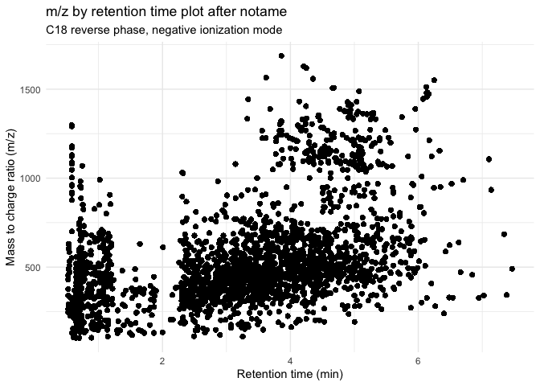<!-- -->

``` r
before_notame / after_notame
```

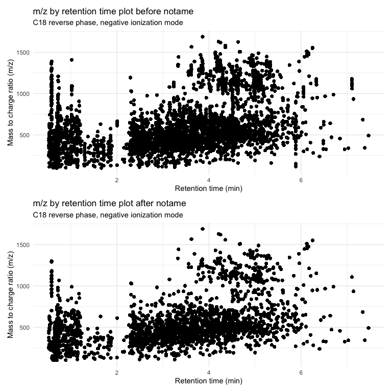<!-- -->

## Assessing data quality

Let’s make sure that our data is of good quality.

### Untransformed data

First we are going to convert the type of some of the columns to match
what we want (e.g., run order converted to numeric, species to factor)

``` r
tibble(metab_imputed_clustered_long)
```

    ## # A tibble: 258,796 × 16
    ##    plot  sample qc_batch run_order accession   rep species tarapoto color bitter
    ##    <chr> <chr>  <chr>    <chr>     <chr>     <dbl> <chr>   <chr>    <chr> <chr> 
    ##  1 1002  1002_… 1        013       LA2303        1 SL      Y        R     UNK   
    ##  2 1002  1002_… 1        013       LA2303        1 SL      Y        R     UNK   
    ##  3 1002  1002_… 1        013       LA2303        1 SL      Y        R     UNK   
    ##  4 1002  1002_… 1        013       LA2303        1 SL      Y        R     UNK   
    ##  5 1002  1002_… 1        013       LA2303        1 SL      Y        R     UNK   
    ##  6 1002  1002_… 1        013       LA2303        1 SL      Y        R     UNK   
    ##  7 1002  1002_… 1        013       LA2303        1 SL      Y        R     UNK   
    ##  8 1002  1002_… 1        013       LA2303        1 SL      Y        R     UNK   
    ##  9 1002  1002_… 1        013       LA2303        1 SL      Y        R     UNK   
    ## 10 1002  1002_… 1        013       LA2303        1 SL      Y        R     UNK   
    ## # ℹ 258,786 more rows
    ## # ℹ 6 more variables: selected <chr>, sample_or_qc <chr>, mz <dbl>, rt <dbl>,
    ## #   mz_rt <chr>, rel_abund <dbl>

``` r
metab_imputed_clustered_long$run_order <- as.numeric(metab_imputed_clustered_long$run_order)
metab_imputed_clustered_long$sample <- as.factor(metab_imputed_clustered_long$sample)
metab_imputed_clustered_long$plot <- as.factor(metab_imputed_clustered_long$plot)
metab_imputed_clustered_long$species <- as.factor(metab_imputed_clustered_long$species)

# for species, NA is the QCs so let's change that coding
metab_imputed_clustered_long <- metab_imputed_clustered_long %>%
  mutate(species = if_else(is.na(species), "QC", species))

# did it work?
unique(metab_imputed_clustered_long$species)
```

    ## [1] "SL"  "SLC" "SPI" "SPE" "QC"

Let’s make a boxplot to see how the metabolite abundance looks across
different samples.

``` r
metab_imputed_clustered_long %>%
  ggplot(aes(x = sample, y = rel_abund, fill = species)) +
  geom_boxplot(alpha = 0.6) +
  theme_minimal() +
  theme(axis.text.x = element_text(angle = 90)) +
  labs(title = "LC-MS (-) Feature Abundances by Sample",
       subtitle = "Data is unscaled",
       y = "Relative abundance")
```

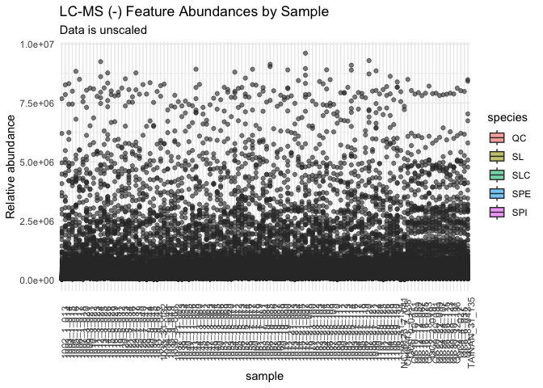<!-- -->

Can’t really see anything because data is skewed.

### Transformed data

#### Log2 transformed

We will log2 transform our data.

``` r
metab_imputed_clustered_long_log2 <- metab_imputed_clustered_long %>%
  mutate(rel_abund = log2(rel_abund))
```

And then plot.

``` r
metab_imputed_clustered_long_log2 %>%
  ggplot(aes(x = sample, y = rel_abund, fill = species)) +
  geom_boxplot(alpha = 0.6) +
  theme_minimal() +
  theme(axis.text.x = element_text(angle = 90)) +
  labs(title = "LC-MS (-) Feature Abundances by Sample",
       subtitle = "Data is log2 transformed",
       y = "Relative abundance")
```

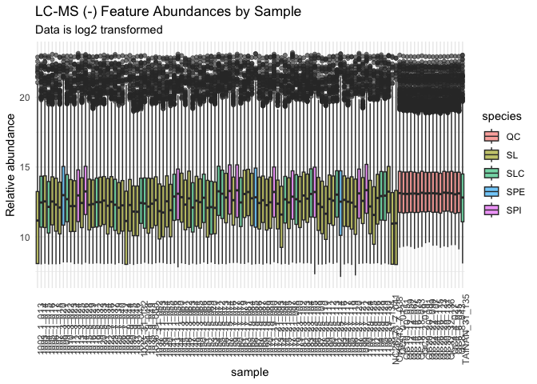<!-- -->

We can look at this data where we group by species.

``` r
metab_imputed_clustered_long_log2 %>%
  mutate(sample = fct_reorder(sample, species)) %>%
  ggplot(aes(x = sample , y = rel_abund, fill = species)) +
  geom_boxplot(alpha = 0.6) +
  scale_fill_brewer(palette = "Reds") + # red bc tomato
  theme_minimal() +
  theme(axis.text.x = element_text(angle = 90)) +
  labs(title = "LC-MS (-) Feature Abundances by Sample",
       subtitle = "Data is log2 transformed",
       y = "Relative abundance")
```

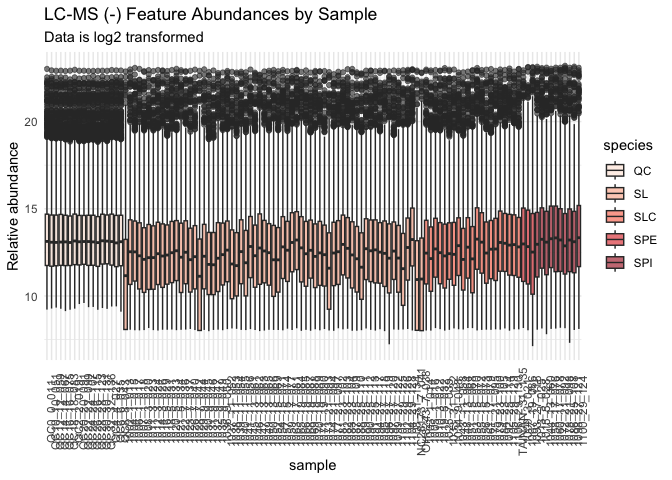<!-- -->

We can also look at this data by run order to see if we have any overall
run order effects visible.

``` r
metab_imputed_clustered_long_log2 %>%
  mutate(sample = fct_reorder(sample, run_order)) %>%
  ggplot(aes(x = sample , y = rel_abund, fill = species)) +
  geom_boxplot(alpha = 0.6) +
  scale_fill_brewer(palette = "Reds") + # red bc tomato
  theme_minimal() +
  theme(axis.text.x = element_text(angle = 90)) +
  labs(title = "LC-MS (-) Feature Abundances by Sample",
       subtitle = "Data is log2 transformed",
       y = "Relative abundance")
```

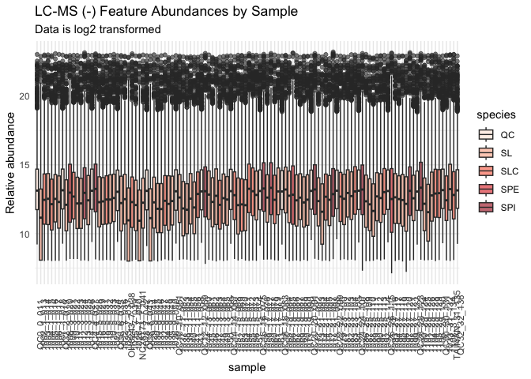<!-- -->

#### Log10 transformed

We will log10 transform our data.

``` r
metab_imputed_clustered_long_log10 <- metab_imputed_clustered_long %>%
  mutate(rel_abund = log10(rel_abund))
```

We can look at this data where we group by species.

``` r
metab_imputed_clustered_long_log10 %>%
  mutate(sample = fct_reorder(sample, species)) %>%
  ggplot(aes(x = sample , y = rel_abund, fill = species)) +
  geom_boxplot(alpha = 0.6) +
  scale_fill_brewer(palette = "Reds") + # red bc tomato
  theme_minimal() +
  theme(axis.text.x = element_text(angle = 90)) +
  labs(title = "LC-MS (-) Feature Abundances by Sample",
       subtitle = "Data is log10 transformed",
       y = "Relative abundance")
```

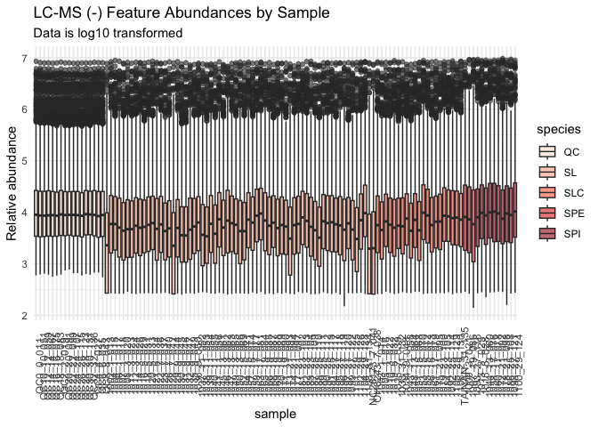<!-- -->

We can also look at this data by run order to see if we have any overall
run order effects visible.

``` r
metab_imputed_clustered_long_log10 %>%
  mutate(sample = fct_reorder(sample, run_order)) %>%
  ggplot(aes(x = sample , y = rel_abund, fill = species)) +
  geom_boxplot(alpha = 0.6) +
  scale_fill_brewer(palette = "Reds") + # red bc tomato
  theme_minimal() +
  theme(axis.text.x = element_text(angle = 90)) +
  labs(title = "LC-MS (-) Feature Abundances by Sample",
       subtitle = "Data is log10 transformed",
       y = "Relative abundance")
```

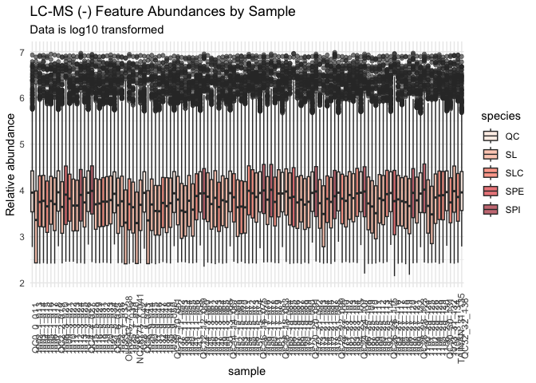<!-- -->

#### Autoscaled

Scales to unit variance, where the mean for each feature is 0 with a
standard deviation of 1. This works well when all metabolites are
considered to be equivalently important though measurement errors can be
inflated. We’ve never actually scaled data this way for a project but
whatever here it is.

``` r
metab_imputed_clustered_wide <- metab_imputed_clustered_long %>%
  select(-mz, -rt) %>%
  pivot_wider(names_from = "mz_rt",
              values_from = "rel_abund")

# autoscaling on the now zero-centered matrix
autoscaled <- 
    bind_cols(metab_imputed_clustered_wide[1:12], # metadata
            lapply(metab_imputed_clustered_wide[13:ncol(metab_imputed_clustered_wide)], # metab data
                   scale)) # scale to mean 0 sd 1

autoscaled[1:10,12:18]
```

    ## # A tibble: 10 × 7
    ##    sample_or_qc `215.035_0.6816`[,1] `132.0314_0.6257`[,1] `146.0471_0.638`[,1]
    ##    <chr>                       <dbl>                 <dbl>                <dbl>
    ##  1 Sample                    -0.470                 1.22                 0.536 
    ##  2 Sample                    -1.07                  0.289               -1.08  
    ##  3 Sample                     1.08                 -0.315               -1.43  
    ##  4 Sample                     2.55                 -0.129                0.0772
    ##  5 Sample                     0.607                -2.35                -1.87  
    ##  6 Sample                    -0.206                -0.658               -1.72  
    ##  7 Sample                    -0.799                -0.161               -1.65  
    ##  8 Sample                    -0.0178               -0.0677              -0.993 
    ##  9 Sample                     1.19                  0.213                0.105 
    ## 10 Sample                     0.690                -1.79                -1.13  
    ## # ℹ 3 more variables: `223.047_0.6813` <dbl[,1]>, `277.0354_0.6491` <dbl[,1]>,
    ## #   `191.0559_0.7112` <dbl[,1]>

``` r
# did it work?
mean(autoscaled$`215.035_0.6816`)
```

    ## [1] 5.895438e-16

``` r
sd(autoscaled$`215.035_0.6816`) # ya
```

    ## [1] 1

``` r
autoscaled_long <- autoscaled %>%
  pivot_longer(cols = 13:ncol(.),
               names_to = "mz_rt",
               values_to = "rel_abund") %>%
  mutate(species = as.factor(species))

autoscaled_long %>%
  mutate(sample = fct_reorder(sample, run_order)) %>%
  ggplot(aes(x = sample , y = rel_abund, fill = species)) +
  geom_boxplot(alpha = 0.6) +
  scale_fill_brewer(palette = "Reds") + # red bc tomato
  theme_minimal() +
  theme(axis.text.x = element_text(angle = 90)) +
  labs(title = "LC-MS (-) Feature Abundances by Sample",
       subtitle = "Data is autoscaled",
       y = "Relative abundance")
```

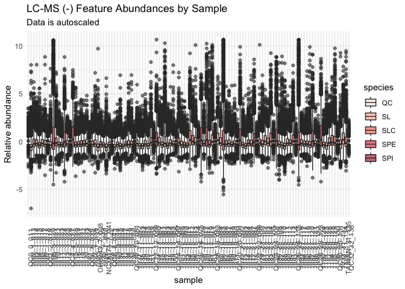<!-- -->

This is weird I wouldn’t want to use this.

#### Pareto scaled

Pareto scaling scales but keeps the fidelity of the original differences
in absolute measurement value more than autoscaling. Often data is
Pareto scaled after log transofmration

``` r
metab_wide_meta_imputed_log2 <- metab_imputed_clustered_long_log2 %>%
  select(-mz, -rt) %>%
  pivot_wider(names_from = "mz_rt",
              values_from = "rel_abund")

metab_imputed_clustered_wide_log2_metabs <- 
  metab_wide_meta_imputed_log2[,13:ncol(metab_wide_meta_imputed_log2)]

pareto_scaled <- 
  IMIFA::pareto_scale(metab_imputed_clustered_wide_log2_metabs, center = FALSE)

pareto_scaled <- bind_cols(metab_wide_meta_imputed_log2[,1:12], pareto_scaled)
```

``` r
pareto_scaled_long <- pareto_scaled %>%
  pivot_longer(cols = 13:ncol(.),
               names_to = "mz_rt",
               values_to = "rel_abund")

pareto_scaled_long %>%
  mutate(sample = fct_reorder(sample, species)) %>%
  ggplot(aes(x = sample , y = rel_abund, fill = species)) +
  geom_boxplot(alpha = 0.6) +
  scale_fill_brewer(palette = "Reds") + # red bc tomato
  theme_minimal() +
  theme(axis.text.x = element_text(angle = 90)) +
  labs(title = "LC-MS (-) Feature Abundances by Sample",
       subtitle = "Data is Pareto scaled",
       y = "Relative abundance")
```

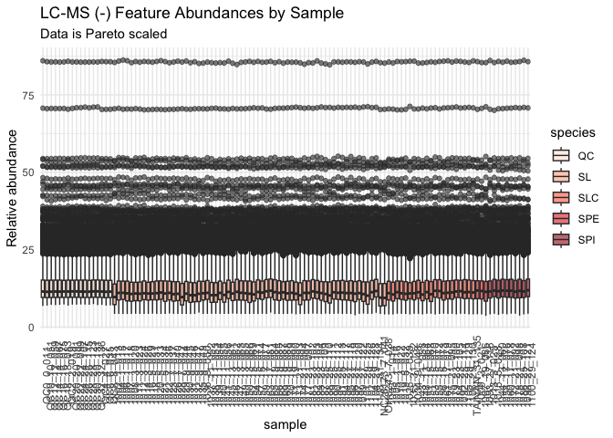<!-- -->

I am going to use log2 transformed data for the rest of this analysis.

## PCAs

### With QCs

``` r
pca_qc <- prcomp(metab_wide_meta_imputed_log2[,-c(1:12)], # remove metadata
                 scale = FALSE, # we did our own scaling
                 center = TRUE) # true is the default

summary(pca_qc)
```

    ## Importance of components:
    ##                            PC1    PC2      PC3      PC4      PC5      PC6
    ## Standard deviation     36.2915 24.057 17.54132 16.12107 15.30196 12.58181
    ## Proportion of Variance  0.2959  0.130  0.06913  0.05839  0.05261  0.03557
    ## Cumulative Proportion   0.2959  0.426  0.49510  0.55349  0.60610  0.64167
    ##                             PC7      PC8     PC9    PC10    PC11    PC12
    ## Standard deviation     11.52620 10.88786 9.99591 9.32770 8.93392 8.02175
    ## Proportion of Variance  0.02985  0.02664 0.02245 0.01955 0.01793 0.01446
    ## Cumulative Proportion   0.67152  0.69815 0.72060 0.74015 0.75808 0.77254
    ##                           PC13    PC14    PC15    PC16    PC17    PC18    PC19
    ## Standard deviation     7.83507 7.42646 7.32619 6.84477 6.46013 6.32646 5.81222
    ## Proportion of Variance 0.01379 0.01239 0.01206 0.01053 0.00938 0.00899 0.00759
    ## Cumulative Proportion  0.78634 0.79873 0.81079 0.82131 0.83069 0.83968 0.84727
    ##                           PC20    PC21    PC22    PC23    PC24    PC25    PC26
    ## Standard deviation     5.75890 5.56346 5.26717 5.09317 4.92708 4.77470 4.75255
    ## Proportion of Variance 0.00745 0.00695 0.00623 0.00583 0.00545 0.00512 0.00507
    ## Cumulative Proportion  0.85473 0.86168 0.86791 0.87374 0.87920 0.88432 0.88939
    ##                           PC27    PC28    PC29    PC30    PC31    PC32    PC33
    ## Standard deviation     4.48209 4.29538 4.23992 4.14442 4.07922 3.93676 3.80874
    ## Proportion of Variance 0.00451 0.00415 0.00404 0.00386 0.00374 0.00348 0.00326
    ## Cumulative Proportion  0.89391 0.89805 0.90209 0.90595 0.90969 0.91317 0.91643
    ##                           PC34    PC35    PC36    PC37    PC38    PC39    PC40
    ## Standard deviation     3.71849 3.69558 3.58778 3.48169 3.41301 3.32145 3.25607
    ## Proportion of Variance 0.00311 0.00307 0.00289 0.00272 0.00262 0.00248 0.00238
    ## Cumulative Proportion  0.91954 0.92261 0.92550 0.92822 0.93084 0.93332 0.93570
    ##                           PC41    PC42    PC43    PC44    PC45    PC46    PC47
    ## Standard deviation     3.14399 3.07499 3.03202 3.02462 2.96783 2.89505 2.84055
    ## Proportion of Variance 0.00222 0.00212 0.00207 0.00206 0.00198 0.00188 0.00181
    ## Cumulative Proportion  0.93792 0.94005 0.94211 0.94417 0.94615 0.94803 0.94984
    ##                           PC48   PC49    PC50    PC51    PC52    PC53   PC54
    ## Standard deviation     2.79409 2.7478 2.70200 2.61653 2.57261 2.52129 2.4928
    ## Proportion of Variance 0.00175 0.0017 0.00164 0.00154 0.00149 0.00143 0.0014
    ## Cumulative Proportion  0.95160 0.9533 0.95493 0.95647 0.95796 0.95939 0.9608
    ##                           PC55    PC56   PC57    PC58    PC59   PC60    PC61
    ## Standard deviation     2.45682 2.44265 2.4024 2.38872 2.36042 2.3147 2.29747
    ## Proportion of Variance 0.00136 0.00134 0.0013 0.00128 0.00125 0.0012 0.00119
    ## Cumulative Proportion  0.96214 0.96348 0.9648 0.96606 0.96731 0.9685 0.96970
    ##                           PC62    PC63    PC64    PC65   PC66    PC67    PC68
    ## Standard deviation     2.27147 2.25523 2.18951 2.17318 2.1110 2.09225 2.08523
    ## Proportion of Variance 0.00116 0.00114 0.00108 0.00106 0.0010 0.00098 0.00098
    ## Cumulative Proportion  0.97086 0.97200 0.97308 0.97414 0.9751 0.97612 0.97710
    ##                           PC69    PC70    PC71    PC72    PC73    PC74    PC75
    ## Standard deviation     2.04924 2.04573 2.01519 1.98776 1.96631 1.95548 1.95357
    ## Proportion of Variance 0.00094 0.00094 0.00091 0.00089 0.00087 0.00086 0.00086
    ## Cumulative Proportion  0.97805 0.97899 0.97990 0.98079 0.98165 0.98251 0.98337
    ##                           PC76    PC77    PC78    PC79    PC80    PC81    PC82
    ## Standard deviation     1.91156 1.87888 1.85910 1.84983 1.82495 1.81637 1.79748
    ## Proportion of Variance 0.00082 0.00079 0.00078 0.00077 0.00075 0.00074 0.00073
    ## Cumulative Proportion  0.98419 0.98499 0.98576 0.98653 0.98728 0.98802 0.98875
    ##                           PC83    PC84    PC85    PC86    PC87    PC88   PC89
    ## Standard deviation     1.77222 1.74596 1.71779 1.69315 1.67496 1.66556 1.6364
    ## Proportion of Variance 0.00071 0.00068 0.00066 0.00064 0.00063 0.00062 0.0006
    ## Cumulative Proportion  0.98945 0.99014 0.99080 0.99144 0.99207 0.99270 0.9933
    ##                           PC90    PC91    PC92    PC93    PC94    PC95    PC96
    ## Standard deviation     1.60169 1.59159 1.56035 1.53581 1.52443 1.51304 1.49928
    ## Proportion of Variance 0.00058 0.00057 0.00055 0.00053 0.00052 0.00051 0.00051
    ## Cumulative Proportion  0.99388 0.99444 0.99499 0.99552 0.99604 0.99656 0.99706
    ##                           PC97    PC98    PC99   PC100   PC101   PC102  PC103
    ## Standard deviation     1.46302 1.43960 1.37477 1.14384 0.84417 0.79148 0.6568
    ## Proportion of Variance 0.00048 0.00047 0.00042 0.00029 0.00016 0.00014 0.0001
    ## Cumulative Proportion  0.99754 0.99801 0.99843 0.99873 0.99889 0.99903 0.9991
    ##                          PC104   PC105   PC106   PC107   PC108   PC109   PC110
    ## Standard deviation     0.64875 0.63282 0.60719 0.59223 0.57666 0.56099 0.55549
    ## Proportion of Variance 0.00009 0.00009 0.00008 0.00008 0.00007 0.00007 0.00007
    ## Cumulative Proportion  0.99922 0.99931 0.99939 0.99947 0.99955 0.99962 0.99969
    ##                          PC111   PC112   PC113   PC114   PC115     PC116
    ## Standard deviation     0.55255 0.53485 0.52453 0.51681 0.50883 2.793e-14
    ## Proportion of Variance 0.00007 0.00006 0.00006 0.00006 0.00006 0.000e+00
    ## Cumulative Proportion  0.99976 0.99982 0.99988 0.99994 1.00000 1.000e+00

Look at how much variance is explained by each PC.

``` r
importance_qc <- summary(pca_qc)$importance %>%
  as.data.frame()

head(importance_qc)
```

    ##                             PC1      PC2      PC3      PC4      PC5      PC6
    ## Standard deviation     36.29152 24.05730 17.54132 16.12107 15.30196 12.58181
    ## Proportion of Variance  0.29593  0.13004  0.06913  0.05839  0.05261  0.03557
    ## Cumulative Proportion   0.29593  0.42596  0.49510  0.55349  0.60610  0.64167
    ##                             PC7      PC8      PC9     PC10     PC11     PC12
    ## Standard deviation     11.52620 10.88786 9.995908 9.327705 8.933916 8.021745
    ## Proportion of Variance  0.02985  0.02664 0.022450 0.019550 0.017930 0.014460
    ## Cumulative Proportion   0.67152  0.69815 0.720600 0.740150 0.758080 0.772540
    ##                            PC13     PC14     PC15     PC16     PC17    PC18
    ## Standard deviation     7.835066 7.426458 7.326193 6.844775 6.460132 6.32646
    ## Proportion of Variance 0.013790 0.012390 0.012060 0.010530 0.009380 0.00899
    ## Cumulative Proportion  0.786340 0.798730 0.810790 0.821310 0.830690 0.83968
    ##                            PC19     PC20     PC21     PC22    PC23     PC24
    ## Standard deviation     5.812216 5.758899 5.563463 5.267168 5.09317 4.927084
    ## Proportion of Variance 0.007590 0.007450 0.006950 0.006230 0.00583 0.005450
    ## Cumulative Proportion  0.847270 0.854730 0.861680 0.867910 0.87374 0.879200
    ##                            PC25     PC26     PC27     PC28     PC29    PC30
    ## Standard deviation     4.774704 4.752554 4.482087 4.295376 4.239922 4.14442
    ## Proportion of Variance 0.005120 0.005070 0.004510 0.004150 0.004040 0.00386
    ## Cumulative Proportion  0.884320 0.889390 0.893910 0.898050 0.902090 0.90595
    ##                            PC31     PC32    PC33     PC34     PC35     PC36
    ## Standard deviation     4.079216 3.936758 3.80874 3.718491 3.695583 3.587783
    ## Proportion of Variance 0.003740 0.003480 0.00326 0.003110 0.003070 0.002890
    ## Cumulative Proportion  0.909690 0.913170 0.91643 0.919540 0.922610 0.925500
    ##                            PC37     PC38     PC39     PC40     PC41     PC42
    ## Standard deviation     3.481694 3.413007 3.321454 3.256073 3.143989 3.074991
    ## Proportion of Variance 0.002720 0.002620 0.002480 0.002380 0.002220 0.002120
    ## Cumulative Proportion  0.928220 0.930840 0.933320 0.935700 0.937920 0.940050
    ##                            PC43     PC44     PC45     PC46     PC47     PC48
    ## Standard deviation     3.032019 3.024617 2.967834 2.895053 2.840553 2.794094
    ## Proportion of Variance 0.002070 0.002060 0.001980 0.001880 0.001810 0.001750
    ## Cumulative Proportion  0.942110 0.944170 0.946150 0.948030 0.949840 0.951600
    ##                            PC49     PC50     PC51     PC52     PC53    PC54
    ## Standard deviation     2.747761 2.701999 2.616534 2.572607 2.521293 2.49281
    ## Proportion of Variance 0.001700 0.001640 0.001540 0.001490 0.001430 0.00140
    ## Cumulative Proportion  0.953290 0.954930 0.956470 0.957960 0.959390 0.96078
    ##                            PC55     PC56     PC57     PC58     PC59    PC60
    ## Standard deviation     2.456822 2.442645 2.402357 2.388722 2.360415 2.31474
    ## Proportion of Variance 0.001360 0.001340 0.001300 0.001280 0.001250 0.00120
    ## Cumulative Proportion  0.962140 0.963480 0.964780 0.966060 0.967310 0.96851
    ##                            PC61     PC62     PC63     PC64     PC65     PC66
    ## Standard deviation     2.297468 2.271474 2.255235 2.189509 2.173177 2.111027
    ## Proportion of Variance 0.001190 0.001160 0.001140 0.001080 0.001060 0.001000
    ## Cumulative Proportion  0.969700 0.970860 0.972000 0.973080 0.974140 0.975140
    ##                            PC67     PC68     PC69     PC70     PC71     PC72
    ## Standard deviation     2.092251 2.085234 2.049238 2.045732 2.015192 1.987762
    ## Proportion of Variance 0.000980 0.000980 0.000940 0.000940 0.000910 0.000890
    ## Cumulative Proportion  0.976120 0.977100 0.978050 0.978990 0.979900 0.980790
    ##                            PC73     PC74     PC75     PC76    PC77     PC78
    ## Standard deviation     1.966309 1.955481 1.953569 1.911562 1.87888 1.859102
    ## Proportion of Variance 0.000870 0.000860 0.000860 0.000820 0.00079 0.000780
    ## Cumulative Proportion  0.981650 0.982510 0.983370 0.984190 0.98499 0.985760
    ##                            PC79    PC80     PC81     PC82     PC83     PC84
    ## Standard deviation     1.849828 1.82495 1.816373 1.797478 1.772218 1.745956
    ## Proportion of Variance 0.000770 0.00075 0.000740 0.000730 0.000710 0.000680
    ## Cumulative Proportion  0.986530 0.98728 0.988020 0.988750 0.989450 0.990140
    ##                            PC85    PC86     PC87     PC88     PC89     PC90
    ## Standard deviation     1.717785 1.69315 1.674957 1.665561 1.636448 1.601691
    ## Proportion of Variance 0.000660 0.00064 0.000630 0.000620 0.000600 0.000580
    ## Cumulative Proportion  0.990800 0.99144 0.992070 0.992700 0.993300 0.993880
    ##                            PC91     PC92     PC93     PC94     PC95     PC96
    ## Standard deviation     1.591592 1.560352 1.535811 1.524428 1.513039 1.499276
    ## Proportion of Variance 0.000570 0.000550 0.000530 0.000520 0.000510 0.000510
    ## Cumulative Proportion  0.994440 0.994990 0.995520 0.996040 0.996560 0.997060
    ##                            PC97     PC98     PC99    PC100     PC101     PC102
    ## Standard deviation     1.463022 1.439601 1.374771 1.143839 0.8441701 0.7914783
    ## Proportion of Variance 0.000480 0.000470 0.000420 0.000290 0.0001600 0.0001400
    ## Cumulative Proportion  0.997540 0.998010 0.998430 0.998730 0.9988900 0.9990300
    ##                            PC103     PC104     PC105     PC106     PC107
    ## Standard deviation     0.6567999 0.6487478 0.6328174 0.6071947 0.5922344
    ## Proportion of Variance 0.0001000 0.0000900 0.0000900 0.0000800 0.0000800
    ## Cumulative Proportion  0.9991300 0.9992200 0.9993100 0.9993900 0.9994700
    ##                            PC108     PC109     PC110     PC111     PC112
    ## Standard deviation     0.5766606 0.5609898 0.5554882 0.5525513 0.5348521
    ## Proportion of Variance 0.0000700 0.0000700 0.0000700 0.0000700 0.0000600
    ## Cumulative Proportion  0.9995500 0.9996200 0.9996900 0.9997600 0.9998200
    ##                            PC113     PC114     PC115        PC116
    ## Standard deviation     0.5245278 0.5168071 0.5088347 2.792766e-14
    ## Proportion of Variance 0.0000600 0.0000600 0.0000600 0.000000e+00
    ## Cumulative Proportion  0.9998800 0.9999400 1.0000000 1.000000e+00

Generate a scree plot.

``` r
fviz_eig(pca_qc)
```

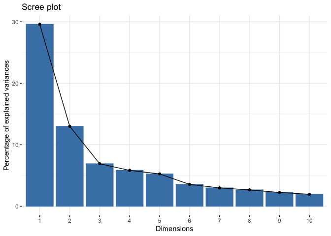<!-- -->

Generate a scores plot (points are samples) quickly with `fviz_pca_ind`.

``` r
fviz_pca_ind(pca_qc)
```

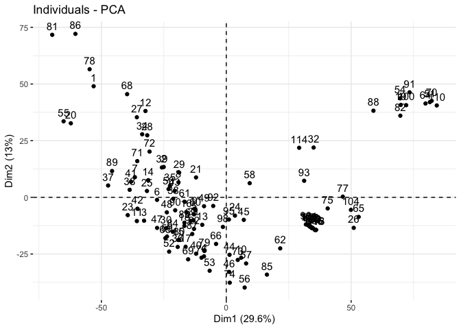<!-- -->

Make a scores plot but prettier.

``` r
# create a df of pca_qc$x
scores_raw_qc <- as.data.frame(pca_qc$x)

# bind meta-data
scores_qc <- bind_cols(metab_wide_meta_imputed_log2[,1:12], # first 3 columns
                    scores_raw_qc)
```

Plot.

``` r
# create objects indicating percent variance explained by PC1 and PC2
PC1_percent_qc <- round((importance_qc[2,1])*100, # index 2nd row, 1st column, times 100
                         1) # round to 1 decimal
PC2_percent_qc <- round((importance_qc[2,2])*100, 1) 

# plot
# aes(text) is for setting tooltip with plotly later to indicate hover text
(scores_qc_plot <- scores_qc %>%
  ggplot(aes(x = PC1, y = PC2, fill = species, text = glue("Sample: {sample},
                                                           Species: {species}"))) +
  geom_hline(yintercept = 0, linetype = "dashed") +
  geom_vline(xintercept = 0, linetype = "dashed") +
  geom_point(shape = 21, color = "black") +
  scale_fill_brewer(palette = "Reds") +
  theme_minimal() +
  labs(x = glue("PC1: {PC1_percent_qc}%"), 
       y = glue("PC2: {PC2_percent_qc}%"), 
       title = "PCA Scores Plot Colored by Species"))
```

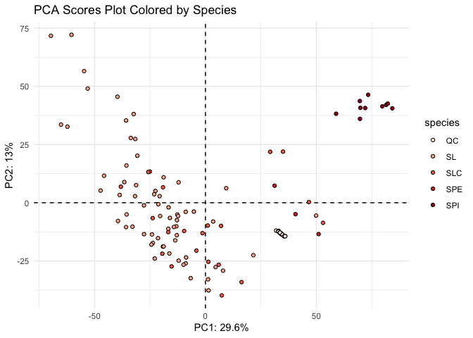<!-- -->

Then make your scores plot ineractive so you can see who is who.

``` r
ggplotly(scores_qc_plot, tooltip = "text")
```

    ## PhantomJS not found. You can install it with webshot::install_phantomjs(). If it is installed, please make sure the phantomjs executable can be found via the PATH variable.

<!-- -->

Make a loadings plot (points are features) even though it might not be
that useful.

``` r
fviz_pca_var(pca_qc)
```

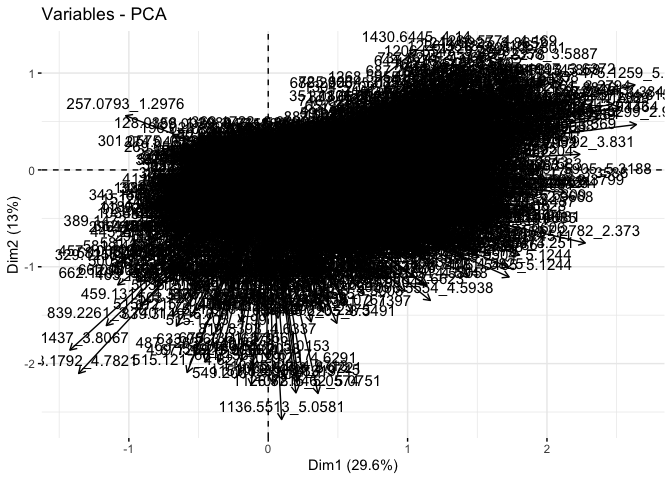<!-- -->

See what I mean? Not that useful. There are some functions in PCAtools
that label only the points that most contribute to each PC. Could also
do this manually if its of interest.

### Without QCs

``` r
metab_wide_meta_imputed_log2_noqc <- metab_wide_meta_imputed_log2 %>%
  filter(!species == "QC")


pca_noqc <- prcomp(metab_wide_meta_imputed_log2_noqc[,-c(1:12)], # remove metadata
                 scale = FALSE, # we did our own scaling
                 center = TRUE) # true is the default

summary(pca_noqc)
```

    ## Importance of components:
    ##                            PC1     PC2      PC3      PC4      PC5      PC6
    ## Standard deviation     36.6908 25.4420 18.59234 16.99450 15.30899 12.78022
    ## Proportion of Variance  0.2805  0.1349  0.07204  0.06019  0.04884  0.03404
    ## Cumulative Proportion   0.2805  0.4154  0.48747  0.54765  0.59649  0.63053
    ##                             PC7      PC8      PC9     PC10    PC11    PC12
    ## Standard deviation     12.47935 11.14632 10.74064 10.04047 9.27307 8.64245
    ## Proportion of Variance  0.03245  0.02589  0.02404  0.02101 0.01792 0.01557
    ## Cumulative Proportion   0.66298  0.68888  0.71292  0.73392 0.75184 0.76741
    ##                           PC13    PC14   PC15    PC16    PC17    PC18    PC19
    ## Standard deviation     8.10178 7.95358 7.4278 7.05855 6.92400 6.40967 6.26648
    ## Proportion of Variance 0.01368 0.01318 0.0115 0.01038 0.00999 0.00856 0.00818
    ## Cumulative Proportion  0.78109 0.79427 0.8058 0.81615 0.82614 0.83470 0.84289
    ##                           PC20   PC21    PC22    PC23    PC24    PC25    PC26
    ## Standard deviation     6.04405 5.7526 5.58087 5.37197 5.18787 5.16482 4.86521
    ## Proportion of Variance 0.00761 0.0069 0.00649 0.00601 0.00561 0.00556 0.00493
    ## Cumulative Proportion  0.85050 0.8574 0.86389 0.86990 0.87551 0.88107 0.88600
    ##                           PC27    PC28    PC29    PC30    PC31   PC32    PC33
    ## Standard deviation     4.66029 4.58695 4.52340 4.41350 4.25814 4.1554 4.02890
    ## Proportion of Variance 0.00453 0.00438 0.00426 0.00406 0.00378 0.0036 0.00338
    ## Cumulative Proportion  0.89053 0.89491 0.89917 0.90323 0.90701 0.9106 0.91399
    ##                           PC34    PC35    PC36    PC37    PC38    PC39    PC40
    ## Standard deviation     4.00723 3.89013 3.75846 3.70353 3.62694 3.52838 3.41309
    ## Proportion of Variance 0.00335 0.00315 0.00294 0.00286 0.00274 0.00259 0.00243
    ## Cumulative Proportion  0.91734 0.92049 0.92344 0.92629 0.92904 0.93163 0.93406
    ##                           PC41    PC42    PC43    PC44    PC45    PC46    PC47
    ## Standard deviation     3.35280 3.29453 3.26804 3.21376 3.14032 3.08283 3.03732
    ## Proportion of Variance 0.00234 0.00226 0.00223 0.00215 0.00206 0.00198 0.00192
    ## Cumulative Proportion  0.93640 0.93866 0.94089 0.94304 0.94510 0.94708 0.94900
    ##                           PC48    PC49    PC50    PC51    PC52    PC53    PC54
    ## Standard deviation     2.98556 2.92209 2.83225 2.78517 2.73048 2.70620 2.66046
    ## Proportion of Variance 0.00186 0.00178 0.00167 0.00162 0.00155 0.00153 0.00148
    ## Cumulative Proportion  0.95086 0.95264 0.95431 0.95592 0.95748 0.95900 0.96048
    ##                           PC55    PC56   PC57    PC58    PC59    PC60    PC61
    ## Standard deviation     2.65275 2.60249 2.5963 2.55923 2.51646 2.49198 2.45856
    ## Proportion of Variance 0.00147 0.00141 0.0014 0.00136 0.00132 0.00129 0.00126
    ## Cumulative Proportion  0.96194 0.96336 0.9648 0.96613 0.96745 0.96874 0.97000
    ##                           PC62    PC63    PC64    PC65    PC66    PC67    PC68
    ## Standard deviation     2.44338 2.37309 2.35209 2.29219 2.27883 2.25835 2.22322
    ## Proportion of Variance 0.00124 0.00117 0.00115 0.00109 0.00108 0.00106 0.00103
    ## Cumulative Proportion  0.97124 0.97242 0.97357 0.97466 0.97575 0.97681 0.97784
    ##                           PC69   PC70    PC71    PC72    PC73    PC74   PC75
    ## Standard deviation     2.21657 2.1888 2.15230 2.13072 2.11817 2.11462 2.0814
    ## Proportion of Variance 0.00102 0.0010 0.00097 0.00095 0.00093 0.00093 0.0009
    ## Cumulative Proportion  0.97886 0.9799 0.98083 0.98177 0.98271 0.98364 0.9845
    ##                           PC76    PC77    PC78    PC79   PC80    PC81    PC82
    ## Standard deviation     2.04200 2.01331 1.99410 1.97598 1.9632 1.94577 1.91686
    ## Proportion of Variance 0.00087 0.00084 0.00083 0.00081 0.0008 0.00079 0.00077
    ## Cumulative Proportion  0.98541 0.98626 0.98709 0.98790 0.9887 0.98949 0.99026
    ##                           PC83    PC84   PC85    PC86    PC87    PC88    PC89
    ## Standard deviation     1.89117 1.86242 1.8285 1.81914 1.79167 1.77011 1.73306
    ## Proportion of Variance 0.00075 0.00072 0.0007 0.00069 0.00067 0.00065 0.00063
    ## Cumulative Proportion  0.99100 0.99172 0.9924 0.99311 0.99378 0.99443 0.99506
    ##                           PC90    PC91    PC92    PC93    PC94    PC95    PC96
    ## Standard deviation     1.72237 1.68836 1.65969 1.64959 1.63586 1.61800 1.57848
    ## Proportion of Variance 0.00062 0.00059 0.00057 0.00057 0.00056 0.00055 0.00052
    ## Cumulative Proportion  0.99568 0.99627 0.99685 0.99741 0.99797 0.99852 0.99903
    ##                          PC97    PC98      PC99
    ## Standard deviation     1.5562 1.48675 2.827e-14
    ## Proportion of Variance 0.0005 0.00046 0.000e+00
    ## Cumulative Proportion  0.9995 1.00000 1.000e+00

Look at how much variance is explained by each PC.

``` r
importance_noqc <- summary(pca_noqc)$importance %>%
  as.data.frame()

head(importance_noqc)
```

    ##                             PC1      PC2      PC3      PC4      PC5      PC6
    ## Standard deviation     36.69084 25.44202 18.59234 16.99450 15.30899 12.78022
    ## Proportion of Variance  0.28054  0.13489  0.07204  0.06019  0.04884  0.03404
    ## Cumulative Proportion   0.28054  0.41543  0.48747  0.54765  0.59649  0.63053
    ##                             PC7      PC8      PC9     PC10     PC11     PC12
    ## Standard deviation     12.47935 11.14632 10.74064 10.04047 9.273073 8.642453
    ## Proportion of Variance  0.03245  0.02589  0.02404  0.02101 0.017920 0.015570
    ## Cumulative Proportion   0.66298  0.68888  0.71292  0.73392 0.751840 0.767410
    ##                            PC13     PC14     PC15     PC16     PC17    PC18
    ## Standard deviation     8.101784 7.953579 7.427761 7.058555 6.923998 6.40967
    ## Proportion of Variance 0.013680 0.013180 0.011500 0.010380 0.009990 0.00856
    ## Cumulative Proportion  0.781090 0.794270 0.805770 0.816150 0.826140 0.83470
    ##                            PC19     PC20     PC21     PC22     PC23     PC24
    ## Standard deviation     6.266477 6.044051 5.752649 5.580874 5.371968 5.187868
    ## Proportion of Variance 0.008180 0.007610 0.006900 0.006490 0.006010 0.005610
    ## Cumulative Proportion  0.842890 0.850500 0.857390 0.863890 0.869900 0.875510
    ##                            PC25     PC26     PC27     PC28     PC29     PC30
    ## Standard deviation     5.164822 4.865206 4.660294 4.586946 4.523401 4.413502
    ## Proportion of Variance 0.005560 0.004930 0.004530 0.004380 0.004260 0.004060
    ## Cumulative Proportion  0.881070 0.886000 0.890530 0.894910 0.899170 0.903230
    ##                            PC31     PC32     PC33     PC34     PC35     PC36
    ## Standard deviation     4.258144 4.155433 4.028901 4.007226 3.890128 3.758462
    ## Proportion of Variance 0.003780 0.003600 0.003380 0.003350 0.003150 0.002940
    ## Cumulative Proportion  0.907010 0.910610 0.913990 0.917340 0.920490 0.923440
    ##                           PC37     PC38     PC39     PC40    PC41     PC42
    ## Standard deviation     3.70353 3.626936 3.528379 3.413092 3.35280 3.294525
    ## Proportion of Variance 0.00286 0.002740 0.002590 0.002430 0.00234 0.002260
    ## Cumulative Proportion  0.92629 0.929040 0.931630 0.934060 0.93640 0.938660
    ##                            PC43     PC44     PC45     PC46    PC47     PC48
    ## Standard deviation     3.268036 3.213761 3.140315 3.082829 3.03732 2.985557
    ## Proportion of Variance 0.002230 0.002150 0.002060 0.001980 0.00192 0.001860
    ## Cumulative Proportion  0.940890 0.943040 0.945100 0.947080 0.94900 0.950860
    ##                           PC49     PC50     PC51    PC52     PC53     PC54
    ## Standard deviation     2.92209 2.832252 2.785169 2.73048 2.706195 2.660457
    ## Proportion of Variance 0.00178 0.001670 0.001620 0.00155 0.001530 0.001480
    ## Cumulative Proportion  0.95264 0.954310 0.955920 0.95748 0.959000 0.960480
    ##                            PC55     PC56     PC57    PC58     PC59     PC60
    ## Standard deviation     2.652748 2.602494 2.596254 2.55923 2.516464 2.491979
    ## Proportion of Variance 0.001470 0.001410 0.001400 0.00136 0.001320 0.001290
    ## Cumulative Proportion  0.961940 0.963360 0.964760 0.96613 0.967450 0.968740
    ##                            PC61     PC62     PC63     PC64     PC65     PC66
    ## Standard deviation     2.458556 2.443376 2.373086 2.352094 2.292187 2.278828
    ## Proportion of Variance 0.001260 0.001240 0.001170 0.001150 0.001090 0.001080
    ## Cumulative Proportion  0.970000 0.971240 0.972420 0.973570 0.974660 0.975750
    ##                            PC67     PC68     PC69     PC70     PC71     PC72
    ## Standard deviation     2.258353 2.223219 2.216565 2.188838 2.152297 2.130721
    ## Proportion of Variance 0.001060 0.001030 0.001020 0.001000 0.000970 0.000950
    ## Cumulative Proportion  0.976810 0.977840 0.978860 0.979860 0.980830 0.981770
    ##                            PC73     PC74     PC75     PC76     PC77     PC78
    ## Standard deviation     2.118169 2.114619 2.081409 2.041999 2.013311 1.994104
    ## Proportion of Variance 0.000930 0.000930 0.000900 0.000870 0.000840 0.000830
    ## Cumulative Proportion  0.982710 0.983640 0.984540 0.985410 0.986260 0.987090
    ##                            PC79     PC80     PC81     PC82     PC83     PC84
    ## Standard deviation     1.975983 1.963197 1.945766 1.916864 1.891169 1.862418
    ## Proportion of Variance 0.000810 0.000800 0.000790 0.000770 0.000750 0.000720
    ## Cumulative Proportion  0.987900 0.988700 0.989490 0.990260 0.991000 0.991720
    ##                            PC85     PC86     PC87     PC88     PC89     PC90
    ## Standard deviation     1.828511 1.819142 1.791672 1.770112 1.733057 1.722373
    ## Proportion of Variance 0.000700 0.000690 0.000670 0.000650 0.000630 0.000620
    ## Cumulative Proportion  0.992420 0.993110 0.993780 0.994430 0.995060 0.995680
    ##                           PC91     PC92     PC93     PC94     PC95     PC96
    ## Standard deviation     1.68836 1.659693 1.649592 1.635861 1.617997 1.578476
    ## Proportion of Variance 0.00059 0.000570 0.000570 0.000560 0.000550 0.000520
    ## Cumulative Proportion  0.99627 0.996850 0.997410 0.997970 0.998520 0.999030
    ##                            PC97     PC98         PC99
    ## Standard deviation     1.556215 1.486752 2.827478e-14
    ## Proportion of Variance 0.000500 0.000460 0.000000e+00
    ## Cumulative Proportion  0.999540 1.000000 1.000000e+00

Generate a scree plot.

``` r
fviz_eig(pca_noqc)
```

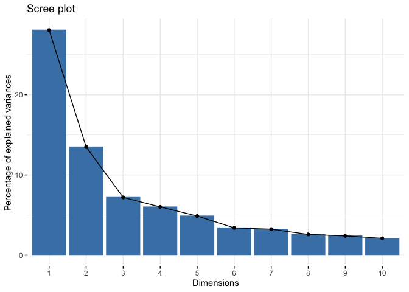<!-- -->

Generate a scores plot (points are samples) quickly with `fviz_pca_ind`.

``` r
fviz_pca_ind(pca_noqc)
```

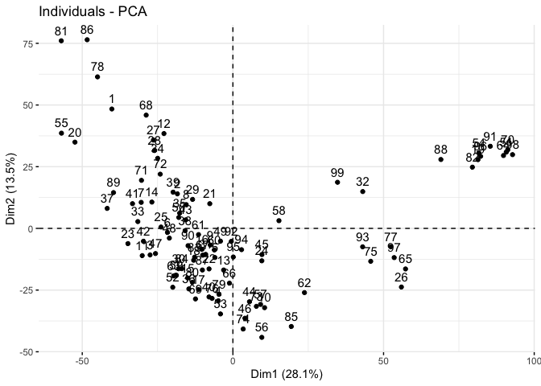<!-- -->

Make a scores plot but prettier.

``` r
# create a df of pca_qc$x
scores_raw_noqc <- as.data.frame(pca_noqc$x)

# bind meta-data
scores_noqc <- bind_cols(metab_wide_meta_imputed_log2_noqc[,1:12], # first 3 columns
                         scores_raw_noqc)
```

Plot.

``` r
# create objects indicating percent variance explained by PC1 and PC2
PC1_percent_noqc <- round((importance_noqc[2,1])*100, # index 2nd row, 1st column, times 100
                         1) # round to 1 decimal
PC2_percent_noqc <- round((importance_noqc[2,2])*100, 1) 

# plot
# aes(text) is for setting tooltip with plotly later to indicate hover text
(scores_noqc_plot <- scores_noqc %>%
  ggplot(aes(x = PC1, y = PC2, fill = species, text = glue("Sample: {sample},
                                                           Species: {species}"))) +
  geom_hline(yintercept = 0, linetype = "dashed") +
  geom_vline(xintercept = 0, linetype = "dashed") +
  geom_point(shape = 21, color = "black") +
  scale_fill_brewer(palette = "Reds") +
  theme_minimal() +
  labs(x = glue("PC1: {PC1_percent_noqc}%"), 
       y = glue("PC2: {PC2_percent_noqc}%"), 
       title = "PCA Scores Plot Colored by Species"))
```

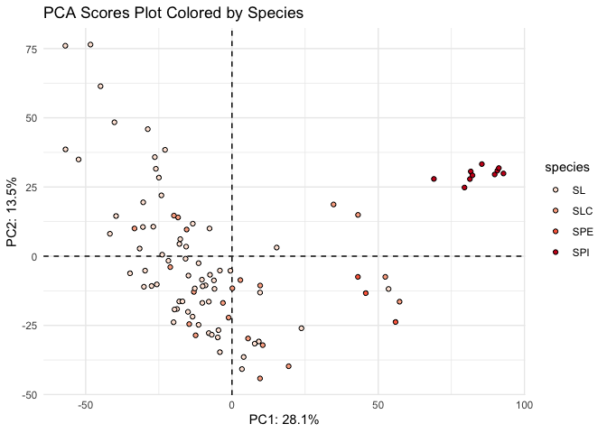<!-- -->

Then make your scores plot interactive so you can see who is who. This
isn’t going to show up in the github doc.

``` r
ggplotly(scores_noqc_plot, tooltip = "text")
```

Make a loadings plot (points are features) even though it might not be
that useful.

``` r
fviz_pca_var(pca_noqc)
```

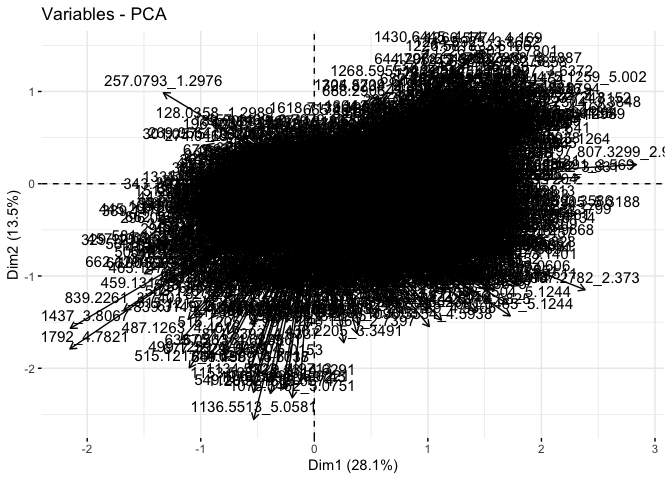<!-- -->

See what I mean? Not that useful. There are some functions in PCAtools
that label only the points that most contribute to each PC. Could also
do this manually if its of interest.

## Univariate Testing

I am going to include some sample univariate testing for comparisons
between two and more than two groups.

Here we are going to compare the metabolite differences between
accessions that have been reported to be bitter, and those that haven’t.
We will do unpaired t-tests and use a multiple testing correction. This
isn’t really a good dataset to ask this question but we are going to do
it for demonstrative purposes.

``` r
# run series of t-tests
bitter_or_not <- metab_imputed_clustered_long_log2 %>%
  filter(bitter == "YES" | bitter == "NO") %>%
  dplyr::select(sample, bitter, mz_rt, rel_abund) %>%
  group_by(mz_rt) %>%
  t_test(rel_abund ~ bitter, 
         paired = FALSE, 
         detailed = TRUE, # gives you more detail in output
         p.adjust.method = "BH") %>% # Benjamini-Hochberg false discovery rate multiple testing correction
  add_significance()

# extract out only the significantly different features
bitter_or_not_sig <- bitter_or_not %>%
  filter(p <= 0.05)

nrow(bitter_or_not_sig)
```

    ## [1] 483

What features are significantly different among the different species?
This isn’t really a good dataset to ask this question but we are going
to do it for demonstrative purposes.

``` r
# run series of t-tests
species_diff <- metab_imputed_clustered_long_log2 %>%
  drop_na(species) %>% # drop NA for species which are the QCs
  dplyr::select(sample, species, mz_rt, rel_abund) %>%
  group_by(mz_rt) %>%
  anova_test(rel_abund ~ species, 
             detailed = TRUE) %>% # gives you more detail in output
#             p.adjust.method = "BH") %>% # Benjamini-Hochberg false discovery rate multiple testing correction
  add_significance() %>%
  as.data.frame()

# extract out only the significantly different features
species_diff_sig <- species_diff %>%
  filter(p <= 0.05)

nrow(species_diff_sig)
```

    ## [1] 2020
